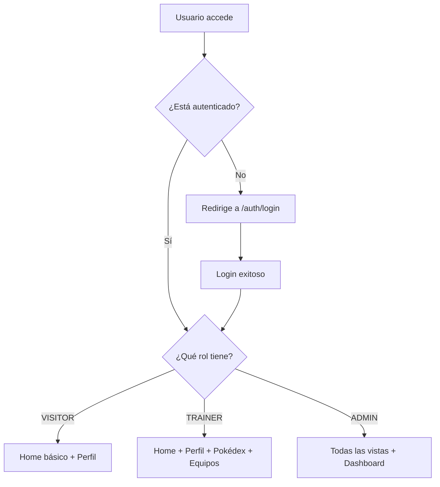

# 🚀 Pokédex - Angular 20 Advanced Application

Una aplicación web moderna y completa desarrollada en **Angular 20** que consume la API pública de **Pokémon (pokeapi.co)**. Esta aplicación demuestra implementaciones avanzadas de arquitectura modular, autenticación basada en roles, internacionalización, y gestión de estado empresarial.

## ✨ Características Principales

### 🔐 Sistema de Autenticación Completo
- **Registro e Inicio de Sesión**: Formularios reactivos con validaciones robustas
- **Gestión de Sesiones**: Persistencia de sesión con cookies seguras
- **Sistema de Roles**: Tres tipos de usuarios con permisos diferenciados

### 🎯 Roles y Permisos Detallados

#### 👑 **ADMIN** - Acceso Total
**Vistas Exclusivas:**
- ✅ **Dashboard**: Panel administrativo con métricas, gráficos Chart.js, estadísticas de usuarios
- ✅ **Gestión Completa**: Todos los permisos de TRAINER + funciones administrativas

**Funcionalidades:**
- Visualizar métricas de uso de la aplicación
- Acceso a estadísticas de todos los usuarios
- Gestión completa del Pokédex (CRUD)
- Administración de equipos de todos los usuarios
- Panel de control con gráficos interactivos

#### 🏋️ **TRAINER** (Entrenador) - Gestión Pokémon
**Vistas Disponibles:**
- ✅ **Home**: Página principal con recomendaciones
- ✅ **Pokédex**: Exploración completa de Pokémon
- ✅ **Mis Equipos**: Gestión personal de equipos
- ✅ **Perfil**: Configuración personal

**Funcionalidades:**
- Buscar y filtrar Pokémon en el Pokédex
- Crear, editar y eliminar equipos personales
- Ver estadísticas y análisis de equipos
- Recibir recomendaciones de Pokémon
- Visualizar tarjetas detalladas de Pokémon

#### 👀 **VISITOR** (Visitante) - Vista Limitada
**Vistas Disponibles:**
- ✅ **Home**: Página principal (vista básica)
- ✅ **Perfil**: Solo visualización y edición personal
- ❌ **Pokédex**: Sin acceso
- ❌ **Equipos**: Sin acceso
- ❌ **Dashboard**: Sin acceso

**Funcionalidades:**
- Visualización básica de información
- Acceso limitado al contenido
- Solo gestión de perfil personal
- Navegación básica por la aplicación

### 🌐 Internacionalización (i18n)
- **Soporte multiidioma**: Español, Inglés y Portugués
- Cambio dinámico de idioma
- Traducción completa de la interfaz
- Persistencia de preferencia de idioma

### 🏠 Landing Page Atractiva
- Página de bienvenida accesible sin autenticación
- Presentación de características de la aplicación
- Diseño moderno y responsivo
- Call-to-action para registro/login

### 🎨 Interfaz de Usuario Moderna
- **PrimeNG**: Componentes UI profesionales
- **TailwindCSS**: Diseño responsivo y moderno
- **Tema personalizable**: Modo claro/oscuro
- **Diseño responsivo**: Optimizado para todos los dispositivos

### 📱 Funcionalidades Pokémon

#### 🔍 **Pokédex Interactivo**
- Búsqueda y filtrado avanzado de Pokémon
- Visualización detallada de estadísticas
- Tarjetas de Pokémon con información completa
- Paginación y carga optimizada

#### 👥 **Gestión de Equipos**
- Crear equipos personalizados de Pokémon
- Editar composición de equipos
- Análisis de fortalezas y debilidades
- Recomendaciones basadas en tipos

#### 📊 **Dashboard Administrativo**
- Métricas de uso de la aplicación
- Gráficos interactivos con Chart.js
- Estadísticas de usuarios y equipos
- Panel de control completo

## 🏗️ Arquitectura del Sistema

### 🎯 Patrón de Arquitectura
La aplicación implementa **Clean Architecture** con separación clara de responsabilidades:

```
┌─────────────────────────────────────────┐
│                PRESENTATION              │
│  ┌─────────────┐  ┌─────────────────────┐│
│  │ Components  │  │     Guards          ││ 
│  │ Pages       │  │     Interceptors    ││
│  └─────────────┘  └─────────────────────┘│
└─────────────────────────────────────────┘
┌─────────────────────────────────────────┐
│               BUSINESS LOGIC             │
│  ┌─────────────┐  ┌─────────────────────┐│
│  │  Services   │  │     Models          ││
│  │  Use Cases  │  │     Interfaces      ││
│  └─────────────┘  └─────────────────────┘│
└─────────────────────────────────────────┘
┌─────────────────────────────────────────┐
│                 DATA LAYER              │
│  ┌─────────────┐  ┌─────────────────────┐│
│  │ HTTP Client │  │     Local Storage   ││
│  │ API Service │  │     Cache Service   ││
│  └─────────────┘  └─────────────────────┘│
└─────────────────────────────────────────┘
```

### � Patrones de Diseño Implementados

#### 1. **Repository Pattern**
```typescript
// Abstracción de acceso a datos
abstract class PokemonRepository {
  abstract getPokemon(id: number): Observable<Pokemon>;
  abstract searchPokemon(query: string): Observable<Pokemon[]>;
}

// Implementación concreta
@Injectable()
class PokemonApiRepository extends PokemonRepository {
  constructor(private http: HttpClient) { super(); }
  
  getPokemon(id: number): Observable<Pokemon> {
    return this.http.get<Pokemon>(`${this.apiUrl}/pokemon/${id}`);
  }
}
```

#### 2. **Observer Pattern (RxJS)**
```typescript
// Gestión de estado reactivo
@Injectable()
export class TeamService {
  private teamsSubject = new BehaviorSubject<Team[]>([]);
  public teams$ = this.teamsSubject.asObservable();
  
  addPokemonToTeam(teamId: string, pokemon: Pokemon): void {
    const currentTeams = this.teamsSubject.value;
    // Lógica de actualización
    this.teamsSubject.next(updatedTeams);
  }
}
```

#### 3. **Factory Pattern**
```typescript
// Factory para crear diferentes tipos de usuarios
@Injectable()
export class UserFactory {
  createUser(role: UserRole, userData: Partial<User>): User {
    switch (role) {
      case UserRole.ADMIN:
        return new AdminUser(userData);
      case UserRole.TRAINER:
        return new TrainerUser(userData);
      default:
        return new VisitorUser(userData);
    }
  }
}
```

#### 4. **Strategy Pattern**
```typescript
// Estrategias de filtrado de Pokémon
interface FilterStrategy {
  apply(pokemon: Pokemon[], criteria: any): Pokemon[];
}

class TypeFilterStrategy implements FilterStrategy {
  apply(pokemon: Pokemon[], type: string): Pokemon[] {
    return pokemon.filter(p => p.types.includes(type));
  }
}

class GenerationFilterStrategy implements FilterStrategy {
  apply(pokemon: Pokemon[], generation: number): Pokemon[] {
    return pokemon.filter(p => p.generation === generation);
  }
}
```

## 📚 Documentación de APIs

### 🌐 API Externa - PokéAPI
```typescript
interface PokeApiEndpoints {
  // Endpoints principales utilizados
  pokemon: '/pokemon/{id}' | '/pokemon/{name}';
  pokemonList: '/pokemon?limit={limit}&offset={offset}';
  type: '/type/{id}' | '/type/{name}';
  generation: '/generation/{id}' | '/generation/{name}';
  species: '/pokemon-species/{id}';
}

// Ejemplo de uso
const pokemonData = await this.http.get(
  `https://pokeapi.co/api/v2/pokemon/25`
).toPromise();
```

### 🔧 APIs Internas

#### AuthService API
```typescript
interface AuthService {
  // Autenticación
  login(credentials: LoginCredentials): Observable<AuthResponse>;
  register(userData: NewUser): Observable<User>;
  logout(): void;
  
  // Verificación de roles
  isLoggedIn(): boolean;
  isAdmin(): boolean;
  isTrainer(): boolean;
  hasRole(role: UserRole): boolean;
  hasAnyRole(roles: UserRole[]): boolean;
  
  // Permisos específicos
  canManagePokedex(): boolean;
  canManageTeams(): boolean;
}
```

#### TeamService API
```typescript
interface TeamService {
  // CRUD Operations
  getTeams(): Observable<Team[]>;
  getTeam(id: string): Observable<Team>;
  createTeam(team: Partial<Team>): Observable<Team>;
  updateTeam(id: string, team: Partial<Team>): Observable<Team>;
  deleteTeam(id: string): Observable<boolean>;
  
  // Team Management
  addPokemonToTeam(teamId: string, pokemon: Pokemon): Observable<Team>;
  removePokemonFromTeam(teamId: string, pokemonId: string): Observable<Team>;
  
  // Analytics
  getTeamStats(teamId: string): Observable<TeamStats>;
  getTeamRecommendations(teamId: string): Observable<Pokemon[]>;
}
```

#### PokemonService API
```typescript
interface PokemonService {
  // Search & Filter
  searchPokemon(query: string): Observable<Pokemon[]>;
  filterByType(type: PokemonType): Observable<Pokemon[]>;
  filterByGeneration(generation: number): Observable<Pokemon[]>;
  
  // Details
  getPokemonDetails(id: number): Observable<PokemonDetail>;
  getPokemonEvolutions(id: number): Observable<Evolution[]>;
  
  // Cache Management
  clearCache(): void;
  preloadPokemon(ids: number[]): Observable<Pokemon[]>;
}
```

## 🛠 Tecnologías y Configuraciones Avanzadas

### Core Framework
- **Angular 20.2**: Framework principal con las últimas características
- **TypeScript**: Tipado estático para mayor robustez
- **RxJS**: Programación reactiva y gestión de estados

### UI/UX
- **PrimeNG 20.1**: Biblioteca de componentes UI avanzados
- **TailwindCSS 4.1**: Framework CSS utilitario
- **PrimeIcons**: Iconografía profesional
- **Chart.js 4.5**: Visualización de datos interactiva

### Funcionalidades Avanzadas
- **NGX-Translate**: Internacionalización completa
- **NGX-Cookie-Service**: Gestión segura de cookies
- **Reactive Forms**: Formularios reactivos con validaciones
- **Router Guards**: Protección de rutas basada en roles

### Desarrollo y Calidad
- **Angular CLI 20.2**: Herramientas de desarrollo
- **Prettier**: Formateo automático de código
- **ESLint**: Análisis estático de código
- **Karma & Jasmine**: Testing unitario

### 🔧 Configuraciones Específicas

#### TailwindCSS + PrimeNG Integration
```typescript
// tailwind.config.js
module.exports = {
  content: ['./src/**/*.{html,ts}'],
  plugins: [require('tailwindcss-primeui')],
  theme: {
    extend: {
      colors: {
        primary: 'var(--p-primary-color)',
        surface: 'var(--p-surface-ground)'
      }
    }
  }
}
```

#### Interceptors Configuration
```typescript
// HTTP Error Interceptor
@Injectable()
export class ErrorInterceptor implements HttpInterceptor {
  intercept(req: HttpRequest<any>, next: HttpHandler): Observable<HttpEvent<any>> {
    return next.handle(req).pipe(
      catchError((error: HttpErrorResponse) => {
        if (error.status === 401) {
          this.authService.logout();
          this.router.navigate(['/auth/login']);
        }
        return throwError(() => error);
      })
    );
  }
}
```

#### Route Guards Implementation
```typescript
// Role-based guard example
export function roleGuard(allowedRoles: UserRole[]): CanActivateFn {
  return (route, state) => {
    const authService = inject(AuthService);
    const router = inject(Router);

    if (!authService.isLoggedIn()) {
      router.navigate(['/auth/login']);
      return false;
    }

    return authService.hasAnyRole(allowedRoles) || 
           (router.navigate(['/unauthorized']), false);
  };
}
```

## 💡 Ejemplos de Uso

### 🔍 Implementación de Búsqueda Avanzada
```typescript
@Component({
  selector: 'app-pokemon-search',
  template: `
    <div class="search-container">
      <p-inputGroup>
        <input 
          pInputText 
          [(ngModel)]="searchTerm"
          (input)="onSearch($event)"
          placeholder="Buscar Pokémon..."
        >
        <p-button 
          icon="pi pi-search" 
          (onClick)="performSearch()"
        ></p-button>
      </p-inputGroup>
      
      <div class="filters">
        <p-dropdown 
          [options]="pokemonTypes" 
          [(ngModel)]="selectedType"
          placeholder="Filtrar por tipo"
          (onChange)="onTypeFilter($event)"
        ></p-dropdown>
      </div>
    </div>
  `
})
export class PokemonSearchComponent {
  searchTerm = '';
  selectedType: PokemonType | null = null;
  
  constructor(
    private pokemonService: PokemonService,
    private filterService: PokemonFilterService
  ) {}
  
  onSearch(event: Event): void {
    const query = (event.target as HTMLInputElement).value;
    this.searchSubject.next(query);
  }
  
  private searchSubject = new Subject<string>();
  
  ngOnInit(): void {
    // Debounced search
    this.searchSubject.pipe(
      debounceTime(300),
      distinctUntilChanged(),
      switchMap(query => this.pokemonService.searchPokemon(query))
    ).subscribe(results => {
      this.searchResults = results;
    });
  }
}
```

### 🎨 Custom Pipe Example
```typescript
@Pipe({ name: 'pokemonType' })
export class PokemonTypePipe implements PipeTransform {
  private typeColors: Record<string, string> = {
    fire: '#FF6B6B',
    water: '#4ECDC4',
    grass: '#95E1D3',
    electric: '#FFD93D',
    // ... más tipos
  };
  
  transform(type: string, property: 'color' | 'icon' = 'color'): string {
    switch (property) {
      case 'color':
        return this.typeColors[type] || '#6C757D';
      case 'icon':
        return `pi pi-${type.toLowerCase()}`;
      default:
        return type;
    }
  }
}
```

### 📊 Chart.js Integration
```typescript
@Component({
  selector: 'app-team-stats-chart',
  template: `
    <div class="chart-container">
      <canvas #statsChart></canvas>
    </div>
  `
})
export class TeamStatsChartComponent implements OnInit {
  @ViewChild('statsChart') chartRef!: ElementRef<HTMLCanvasElement>;
  private chart!: Chart;
  
  ngOnInit(): void {
    this.initChart();
  }
  
  private initChart(): void {
    const ctx = this.chartRef.nativeElement.getContext('2d');
    
    this.chart = new Chart(ctx!, {
      type: 'radar',
      data: {
        labels: ['Attack', 'Defense', 'Speed', 'HP', 'Sp.Attack', 'Sp.Defense'],
        datasets: [{
          label: 'Team Average Stats',
          data: this.teamStats,
          backgroundColor: 'rgba(54, 162, 235, 0.2)',
          borderColor: 'rgba(54, 162, 235, 1)',
          borderWidth: 2
        }]
      },
      options: {
        responsive: true,
        plugins: {
          title: {
            display: true,
            text: 'Team Performance Analysis'
          }
        },
        scales: {
          r: {
            beginAtZero: true,
            max: 200
          }
        }
      }
    });
  }
}
```

## 🚀 Instalación y Configuración

### Prerrequisitos
- Node.js 18+ 
- npm 9+
- Angular CLI 20+

### Instalación

1. **Clonar el repositorio**
```bash
git clone <repository-url>
cd Pokedex
```

2. **Instalar dependencias**
```bash
npm install
```

3. **Iniciar servidor de desarrollo**
```bash
npm start
# o
ng serve
```

4. **Acceder a la aplicación**
```
http://localhost:4200
```

## 📋 Scripts Disponibles

```bash
# Desarrollo
npm start              # Inicia servidor de desarrollo
npm run watch          # Compilación en modo watch

# Construcción
npm run build          # Build de producción
npm run build --prod   # Build optimizado

# Testing
npm test               # Ejecuta tests unitarios
npm run test:watch     # Tests en modo watch

# Linting y formato
npm run lint           # Análisis de código
npm run format         # Formateo con Prettier
```

## 🗂 Estructura del Proyecto

```
src/
├── app/
│   ├── core/                    # Servicios core y modelos
│   │   ├── guards/             # Protección de rutas
│   │   ├── interceptors/       # HTTP interceptors
│   │   ├── models/             # Interfaces y modelos
│   │   └── services/           # Servicios de la aplicación
│   ├── feature/                # Módulos de funcionalidades
│   │   ├── auth/              # Autenticación
│   │   ├── landing/           # Página de inicio
│   │   └── main/              # Funcionalidades principales
│   │       ├── components/    # Componentes reutilizables
│   │       ├── pages/         # Páginas de la aplicación
│   │       └── layout/        # Layout principal
│   ├── shared/                # Componentes compartidos
│   │   ├── components/        # Componentes comunes
│   │   ├── pipes/            # Pipes personalizados
│   │   └── utils/            # Utilidades
│   └── environments/          # Configuraciones de entorno
├── public/
│   ├── i18n/                  # Archivos de traducción
│   └── data/                  # Datos estáticos
└── assets/                    # Recursos estáticos
```

## 🔧 Configuración de Entornos

### Desarrollo
- API Base: `https://pokeapi.co/api/v2/`
- Modo debug activado
- Source maps habilitados

### Producción
- Optimizaciones AOT
- Tree shaking
- Minificación
- Service Worker (PWA ready)

## 🎯 Rutas y Navegación por Rol

### 🌐 Rutas Públicas (Sin Autenticación)
- `/landing` - Página de bienvenida (accesible para todos)
- `/auth/login` - Inicio de sesión
- `/auth/register` - Registro de usuario

### 🔐 Rutas Protegidas por Rol

#### 👀 **VISITOR** - Acceso Básico
```
✅ /              # Página principal (vista limitada)
✅ /profile       # Perfil personal
❌ /dashboard     # Sin acceso
❌ /pokedex       # Sin acceso  
❌ /my-teams      # Sin acceso
```

#### 🏋️ **TRAINER** - Gestión Pokémon
```
✅ /              # Página principal (completa)
✅ /profile       # Perfil personal
✅ /pokedex       # Exploración de Pokémon
✅ /my-teams      # Gestión de equipos
✅ /my-teams/:id  # Detalles de equipo específico
❌ /dashboard     # Sin acceso (solo admin)
```

#### 👑 **ADMIN** - Acceso Total
```
✅ /              # Página principal (completa)
✅ /profile       # Perfil personal
✅ /pokedex       # Gestión completa del Pokédex
✅ /my-teams      # Gestión de equipos
✅ /my-teams/:id  # Detalles de equipo específico
✅ /dashboard     # Panel administrativo exclusivo
```

### 🛡️ Guards de Protección
- **`authGuard`**: Evita acceso a auth si ya está logueado
- **`guessGuard`**: Requiere autenticación para rutas principales  
- **`visitorGuard`**: Acceso para usuarios autenticados (todos los roles)
- **`canManagePokedexGuard`**: Solo TRAINER y ADMIN
- **`canManageTeamsGuard`**: Solo TRAINER y ADMIN
- **`adminGuard`**: Exclusivo para ADMIN

## 📊 Matriz de Permisos por Rol

| Funcionalidad | 👀 VISITOR | �️ TRAINER | 👑 ADMIN |
|---------------|------------|-------------|-----------|
| **Landing Page** | ✅ Sí | ✅ Sí | ✅ Sí |
| **Autenticación** | ✅ Sí | ✅ Sí | ✅ Sí |
| **Home/Inicio** | ✅ Vista básica | ✅ Vista completa | ✅ Vista completa |
| **Perfil Personal** | ✅ Solo edición propia | ✅ Solo edición propia | ✅ Gestión completa |
| **Pokédex** | ❌ Sin acceso | ✅ Exploración completa | ✅ Gestión + CRUD |
| **Mis Equipos** | ❌ Sin acceso | ✅ CRUD equipos propios | ✅ CRUD todos los equipos |
| **Dashboard** | ❌ Sin acceso | ❌ Sin acceso | ✅ Panel administrativo |
| **Métricas/Gráficos** | ❌ Sin acceso | ❌ Sin acceso | ✅ Chart.js completo |
| **Gestión Usuarios** | ❌ Sin acceso | ❌ Sin acceso | ✅ Vista de todos |

### 🔑 Flujo de Acceso por Rol



### 🔒 Seguridad
- Autenticación JWT
- Guards de ruta por roles
- Validaciones en cliente y servidor
- Sanitización de datos

### ⚡ Performance
- Lazy loading de módulos
- OnPush change detection
- Optimización de imágenes
- Caché inteligente de datos

### 🎨 UX/UI
- Diseño Material Design
- Animaciones fluidas
- Loading states
- Error handling elegante
- Responsive design

### 🧪 Testing
- Cobertura de tests unitarios
- Tests de integración
- E2E testing preparado
- Mocking de servicios

## 📱 Funcionalidades por Pantalla

### 🏠 Landing Page
- Presentación de la aplicación
- Características principales
- Call-to-action para registro
- Diseño atractivo y moderno

### 🔐 Autenticación
- **Login**: Email, contraseña, recordar sesión
- **Registro**: Datos completos con validaciones
- Mensajes de error informativos
- Redirección inteligente por rol

### 🏡 Home
- Pokémon recomendados
- Acceso rápido a funcionalidades
- Estadísticas personales
- Navegación intuitiva

### 📊 Dashboard (Solo Admin)
- Métricas de usuarios
- Estadísticas de equipos
- Gráficos interactivos
- Panel de control completo

### 🔍 Pokédex
- Búsqueda avanzada
- Filtros por tipo, generación
- Tarjetas detalladas
- Información completa

### 👥 Mis Equipos
- Lista de equipos personales
- Crear nuevo equipo
- Editar equipos existentes
- Análisis de fortalezas

## 📋 Guías de Desarrollo

### 🎯 Convenciones de Código

#### Estructura de Archivos
```
feature-name/
├── components/
│   └── component-name/
│       ├── component-name.component.ts
│       ├── component-name.component.html
│       ├── component-name.component.scss
│       └── component-name.component.spec.ts
├── services/
│   └── feature-name.service.ts
├── models/
│   └── feature-name.model.ts
└── feature-name.routes.ts
```

#### Naming Conventions
```typescript
// Components: PascalCase + Component suffix
export class PokemonCardComponent { }

// Services: PascalCase + Service suffix  
export class AuthService { }

// Interfaces: PascalCase (optional I prefix)
export interface Pokemon { }
export interface IUserRepository { }

// Enums: PascalCase
export enum UserRole {
  ADMIN = 'admin',
  TRAINER = 'trainer'
}

// Constants: UPPER_SNAKE_CASE
export const API_ENDPOINTS = {
  POKEMON: '/pokemon',
  USERS: '/users'
} as const;
```

#### Component Structure
```typescript
@Component({
  selector: 'app-pokemon-card',
  templateUrl: './pokemon-card.component.html',
  styleUrls: ['./pokemon-card.component.scss'],
  changeDetection: ChangeDetectionStrategy.OnPush
})
export class PokemonCardComponent implements OnInit, OnDestroy {
  // 1. Public properties (inputs)
  @Input() pokemon!: Pokemon;
  @Input() showActions = true;
  
  // 2. Outputs
  @Output() pokemonSelected = new EventEmitter<Pokemon>();
  
  // 3. ViewChild/ViewChildren
  @ViewChild('cardElement') cardRef!: ElementRef;
  
  // 4. Private/protected properties
  private destroy$ = new Subject<void>();
  
  // 5. Constructor (inject dependencies)
  constructor(
    private pokemonService: PokemonService,
    private cdr: ChangeDetectorRef
  ) {}
  
  // 6. Lifecycle hooks
  ngOnInit(): void {
    this.initComponent();
  }
  
  ngOnDestroy(): void {
    this.destroy$.next();
    this.destroy$.complete();
  }
  
  // 7. Public methods (template accessible)
  onPokemonClick(): void {
    this.pokemonSelected.emit(this.pokemon);
  }
  
  // 8. Private methods
  private initComponent(): void {
    // Initialization logic
  }
}
```

### 🔧 Mejores Prácticas Implementadas

#### 1. **Reactive Programming**
```typescript
// ✅ Buena práctica - Reactive streams
@Injectable()
export class PokemonSearchService {
  private searchTerms = new Subject<string>();
  
  searchResults$ = this.searchTerms.pipe(
    debounceTime(300),
    distinctUntilChanged(),
    switchMap(term => this.searchPokemon(term)),
    shareReplay(1)
  );
  
  search(term: string): void {
    this.searchTerms.next(term);
  }
}
```

#### 2. **Error Handling**
```typescript
// ✅ Global error handling
@Injectable()
export class GlobalErrorHandler implements ErrorHandler {
  handleError(error: Error): void {
    console.error('Global error:', error);
    this.toastService.showError('Ha ocurrido un error inesperado');
    
    // Log to external service
    this.logService.logError(error);
  }
}
```

#### 3. **Memory Management**
```typescript
// ✅ Prevent memory leaks
@Component({...})
export class BaseComponent implements OnDestroy {
  protected destroy$ = new Subject<void>();
  
  ngOnDestroy(): void {
    this.destroy$.next();
    this.destroy$.complete();
  }
  
  protected subscription(): OperatorFunction<any, any> {
    return takeUntil(this.destroy$);
  }
}
```

#### 4. **Type Safety**
```typescript
// ✅ Strong typing
interface ApiResponse<T> {
  data: T;
  status: 'success' | 'error';
  message?: string;
}

interface PokemonFilters {
  type?: PokemonType;
  generation?: number;
  searchTerm?: string;
}

// ✅ Type guards
function isPokemon(obj: any): obj is Pokemon {
  return obj && typeof obj.id === 'number' && typeof obj.name === 'string';
}
```

#### 5. **Performance Optimization**
```typescript
// ✅ OnPush strategy
@Component({
  changeDetection: ChangeDetectionStrategy.OnPush
})
export class OptimizedComponent {
  @Input() data!: Pokemon[];
  
  // ✅ Track by function
  trackByPokemonId(index: number, pokemon: Pokemon): number {
    return pokemon.id;
  }
}

// ✅ Lazy loading
const routes: Routes = [
  {
    path: 'pokedex',
    loadComponent: () => import('./pokedex-page.component')
  }
];
```

### 🧪 Testing Guidelines

#### Unit Testing Structure
```typescript
describe('PokemonService', () => {
  let service: PokemonService;
  let httpMock: HttpTestingController;
  
  beforeEach(() => {
    TestBed.configureTestingModule({
      imports: [HttpClientTestingModule],
      providers: [PokemonService]
    });
    
    service = TestBed.inject(PokemonService);
    httpMock = TestBed.inject(HttpTestingController);
  });
  
  it('should fetch pokemon by id', () => {
    const mockPokemon: Pokemon = { id: 1, name: 'Bulbasaur' };
    
    service.getPokemon(1).subscribe(pokemon => {
      expect(pokemon).toEqual(mockPokemon);
    });
    
    const req = httpMock.expectOne(`${API_URL}/pokemon/1`);
    expect(req.request.method).toBe('GET');
    req.flush(mockPokemon);
  });
  
  afterEach(() => {
    httpMock.verify();
  });
});
```

#### Component Testing
```typescript
describe('PokemonCardComponent', () => {
  let component: PokemonCardComponent;
  let fixture: ComponentFixture<PokemonCardComponent>;
  
  beforeEach(async () => {
    await TestBed.configureTestingModule({
      declarations: [PokemonCardComponent],
      imports: [NoopAnimationsModule]
    }).compileComponents();
    
    fixture = TestBed.createComponent(PokemonCardComponent);
    component = fixture.componentInstance;
  });
  
  it('should emit pokemon when clicked', () => {
    const mockPokemon: Pokemon = { id: 1, name: 'Bulbasaur' };
    component.pokemon = mockPokemon;
    
    spyOn(component.pokemonSelected, 'emit');
    
    component.onPokemonClick();
    
    expect(component.pokemonSelected.emit).toHaveBeenCalledWith(mockPokemon);
  });
});
```

## 🤝 Contribución

1. Fork el proyecto
2. Crea una rama feature (`git checkout -b feature/AmazingFeature`)
3. Commit los cambios (`git commit -m 'Add some AmazingFeature'`)
4. Push a la rama (`git push origin feature/AmazingFeature`)
5. Abre un Pull Request

## 📞 Soporte

Para soporte técnico o preguntas sobre la implementación:
- 📧 Email: [email de contacto]
- 📚 Documentación: Revisar código y comentarios
- 🐛 Issues: Usar el sistema de issues de GitHub

## 📄 Licencia

Este proyecto es parte de una prueba técnica y está destinado únicamente para evaluación educativa y profesional.

## 🚀 Despliegue

### 🌐 Entornos de Despliegue

#### Desarrollo Local
```bash
# Instalar dependencias
npm install

# Servir en modo desarrollo
ng serve --open

# Variables de entorno
cp src/environments/environment.example.ts src/environments/environment.ts
```

#### Build de Producción
```bash
# Build optimizado
ng build --configuration=production

# Análisis del bundle
ng build --stats-json
npx webpack-bundle-analyzer dist/stats.json
```

#### Docker Deployment
```dockerfile
# Dockerfile
FROM node:18-alpine AS builder
WORKDIR /app
COPY package*.json ./
RUN npm ci --only=production

COPY . .
RUN npm run build --prod

FROM nginx:alpine
COPY --from=builder /app/dist /usr/share/nginx/html
COPY nginx.conf /etc/nginx/nginx.conf
EXPOSE 80
CMD ["nginx", "-g", "daemon off;"]
```

#### Nginx Configuration
```nginx
server {
    listen 80;
    server_name localhost;
    root /usr/share/nginx/html;
    index index.html;
    
    # Angular routing
    location / {
        try_files $uri $uri/ /index.html;
    }
    
    # API proxy
    location /api/ {
        proxy_pass https://pokeapi.co/api/v2/;
        proxy_set_header Host $host;
    }
    
    # Security headers
    add_header X-Frame-Options "SAMEORIGIN" always;
    add_header X-Content-Type-Options "nosniff" always;
}
```

### 🔍 Troubleshooting

#### Problemas Comunes

**❌ Error: Cannot find module '@angular/core'**
```bash
# Solución
rm -rf node_modules package-lock.json
npm install
```

**❌ Error: Memory leak detected**
```typescript
// Verificar subscripciones sin unsubscribe
// ✅ Solución
export class Component implements OnDestroy {
  private destroy$ = new Subject<void>();
  
  ngOnInit() {
    this.service.data$.pipe(
      takeUntil(this.destroy$)
    ).subscribe();
  }
  
  ngOnDestroy() {
    this.destroy$.next();
    this.destroy$.complete();
  }
}
```

**❌ Error: CORS issues with PokéAPI**
```typescript
// ✅ Solución con proxy
// angular.json
"serve": {
  "builder": "@angular-devkit/build-angular:dev-server",
  "options": {
    "proxyConfig": "proxy.conf.json"
  }
}

// proxy.conf.json
{
  "/api/*": {
    "target": "https://pokeapi.co/api/v2",
    "secure": true,
    "changeOrigin": true,
    "logLevel": "debug"
  }
}
```

**❌ Performance issues con large lists**
```typescript
// ✅ Virtual scrolling
import { ScrollingModule } from '@angular/cdk/scrolling';

// Template
<cdk-virtual-scroll-viewport itemSize="50" class="viewport">
  <div *cdkVirtualFor="let pokemon of pokemon$">
    <app-pokemon-card [pokemon]="pokemon"></app-pokemon-card>
  </div>
</cdk-virtual-scroll-viewport>
```

### ❓ FAQ (Preguntas Frecuentes)

#### **Q: ¿Cómo cambiar el idioma de la aplicación?**
A: Usa el selector de idioma en el header o llama directamente:
```typescript
this.translateService.use('es'); // español
this.translateService.use('en'); // inglés  
this.translateService.use('pt'); // portugués
```

#### **Q: ¿Cómo agregar un nuevo rol de usuario?**
A: 
1. Actualiza el enum `UserRole` en `user.model.ts`
2. Añade el nuevo guard en `role.guard.ts`
3. Actualiza la lógica en `AuthService`
4. Modifica las rutas en `app.routes.ts`

#### **Q: ¿Cómo añadir un nuevo filtro de Pokémon?**
A: Implementa la interfaz `FilterStrategy`:
```typescript
class NewFilterStrategy implements FilterStrategy {
  apply(pokemon: Pokemon[], criteria: any): Pokemon[] {
    return pokemon.filter(/* tu lógica aquí */);
  }
}
```

#### **Q: ¿Cómo optimizar el rendimiento?**
A: 
- Usa `OnPush` change detection
- Implementa `trackBy` functions
- Lazy load modules
- Cache API responses
- Virtual scrolling para listas grandes

#### **Q: ¿Cómo testear componentes con PrimeNG?**
A: Importa los módulos necesarios:
```typescript
TestBed.configureTestingModule({
  imports: [
    NoopAnimationsModule,
    ButtonModule,
    InputTextModule
  ]
});
```

### 📊 Métricas y Monitoreo

#### Performance Budgets
```json
// angular.json
"budgets": [
  {
    "type": "initial",
    "maximumWarning": "500kb",
    "maximumError": "1mb"
  },
  {
    "type": "anyComponentStyle", 
    "maximumWarning": "2kb",
    "maximumError": "4kb"
  }
]
```

#### Lighthouse Scores Target
- **Performance**: > 90
- **Accessibility**: > 95  
- **Best Practices**: > 90
- **SEO**: > 85

#### Bundle Analysis
```bash
# Analizar el tamaño del bundle
ng build --stats-json
npx webpack-bundle-analyzer dist/pokedex/stats.json

# Tree shaking verification
ng build --stats-json --source-map
npx source-map-explorer dist/pokedex/*.js
```

### 🛡️ Seguridad

#### Implementaciones de Seguridad
- **XSS Protection**: Sanitización automática de Angular
- **CSRF Protection**: Tokens en formularios
- **Content Security Policy**: Headers configurados
- **Authentication**: JWT con expiración
- **Authorization**: Guards por ruta y componente

#### Security Checklist
- [ ] Validación de entrada en cliente y servidor
- [ ] Sanitización de datos de usuario
- [ ] HTTPS en producción
- [ ] Dependencias actualizadas (`npm audit`)
- [ ] Headers de seguridad configurados
- [ ] Logs de acceso y errores

---

## 🏆 Logros Técnicos Destacados

✅ **Arquitectura Modular**: Separación clara de responsabilidades  
✅ **Role-Based Access Control**: Sistema de permisos granular  
✅ **Internacionalización**: Soporte completo multiidioma  
✅ **UI/UX Moderna**: Interfaz profesional y responsiva  
✅ **Performance Optimizada**: Lazy loading y optimizaciones  
✅ **Testing Ready**: Estructura preparada para testing  
✅ **PWA Ready**: Preparado para Progressive Web App  
✅ **TypeScript**: Tipado fuerte en toda la aplicación  

**Desarrollado con ❤️ usando Angular 20 y las mejores prácticas de la industria.**
